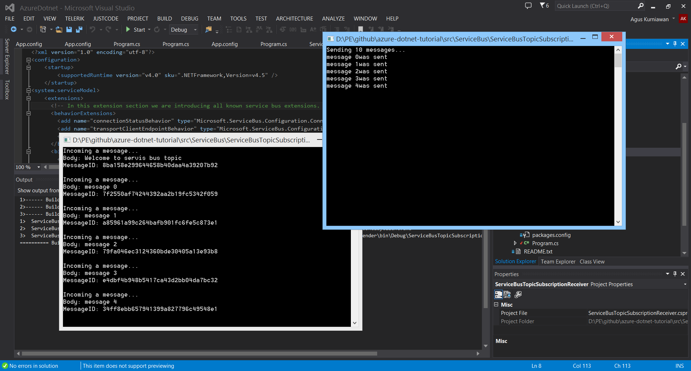

## Note

For service bus relay demo:
+ ServiceBusRelayDemo --> relay and server
+ ServiceBusRelayClient --> client

Please change key and namespace values on App.config file each project.

For service bus topic:
+ ServiceBusTopicSubscriptionSender --> sender message to service bus topic
+ ServiceBusTopicSubscriptionReceiver --> receive message from service bus topic with subscription

